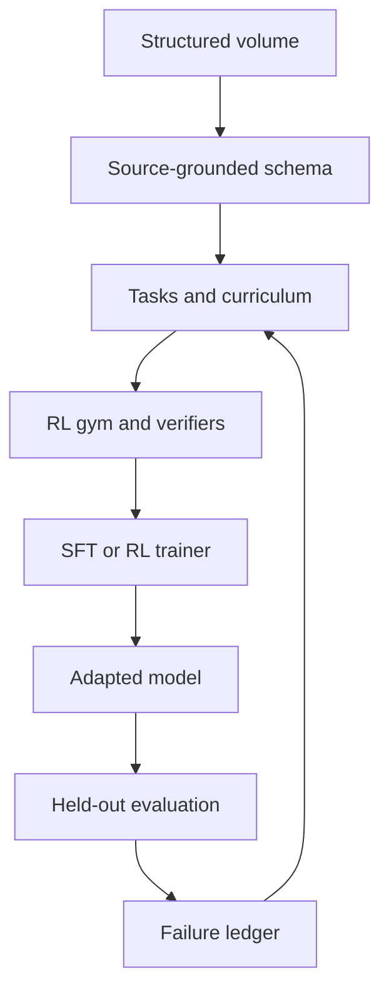

<h1>Volume2Gym</h1>

<h3>The thesis: any single structured volume can be turned into an RL gym that produces trainable models.</h3>

<strong>A research program for compiling whole structured volumes into
source-grounded learning environments for training and evaluation.</strong>

<a href="https://github.com/HarleyCoops/Qwen3-RailroadEngineer1959-RL/tree/main/RailroadEngineer1959">Railroad pipeline source</a> ·
<a href="https://huggingface.co/datasets/HarleyCooper/volume2gym-railroad-1959">Dataset fixture</a> ·
<a href="https://huggingface.co/HarleyCooper/Qwen3-4B-RailRoadEngineer1959">Qwen3-4B LoRA</a> ·
<a href="https://app.primeintellect.ai/dashboard/environments/harleycooper/railroad_1959">RL environment</a>

---

**Status — 17 July 2026:** conceptual architecture, artifact map, and first
domain-specific implementation lineage. No reproducible end-to-end full-volume
recipe is published yet.

## The manual is the simulator

A structured volume is already a compressed expert system. Its chapters define
states; its rules constrain actions; its procedures encode order; its exceptions
mark edge cases; its terminology names the world; and its warnings describe
failure.

Volume2Gym is designed to make that latent system executable.

The target compiler turns a source volume into grounded tasks, explicit answer
contracts, inspectable rewards, held-out evaluations, and failure-driven
curricula. The goal is not merely a model that can quote a book. It is an
environment in which a model can **practice the book, be graded against the
book, and learn from where it fails**.

> **One volume in. A trainable world out.**

## From volume to learning loop

A complete Volume2Gym build should preserve the chain from every training
signal back to its source. It should emit:

- canonical knowledge units with page, section, rule, and span provenance;
- scenario families covering ordinary, edge, conflict, exception, violation,
  and adversarial cases;
- train, development, and test splits across concepts—not only paraphrases;
- structured observation and answer contracts;
- deterministic checks where the source permits them, with judge-based scoring
  isolated and declared where it does not;
- component-level reward ledgers that explain every score;
- adapters for RL and supervised training systems;
- failure clusters that specify the next curriculum; and
- dataset cards, model cards, hashes, recipes, and evaluation records.

The gym supplies grounded tasks and reward signals; a trainer uses those signals
to produce an adapted model. Keeping that boundary explicit lets the same gym
serve different training stacks and model families.

Generality does not mean forcing every book into a railroad-rule schema.
Rulebooks yield conditions, actions, and exceptions; repair manuals yield
symptoms, diagnoses, and procedures; textbooks yield concepts, derivations, and
problems; dictionaries yield senses, relations, and examples. What remains
invariant is the chain from source provenance to task, verifier, evaluation, and
failure-driven curriculum.

## The first full-volume implementation lineage

The intended and reported scope of the first implementation lineage is the
**entire 1959 Consolidated Code of Operating Rules**, not a single railroad
rule. The railroad is a useful wind tunnel: the domain is procedural,
safety-sensitive, full of exceptions, and unusually explicit about what must
and must not happen.

The [pipeline notes](https://github.com/HarleyCoops/Qwen3-RailroadEngineer1959-RL/blob/main/RailroadEngineer1959/PIPELINE_README.md)
reports **536 structured rules** and **2,708 generated scenarios**. Those merged
corpora are not currently present on the public repository's `main` branch, so
these numbers are reported pipeline results rather than independently
reconstructable counts from the published tree.

### Why Rule 99 appears in the current dataset card

The linked Hugging Face dataset contains six training records and one held-out
record, all built around Rule 99. It is a static one-rule fixture that
demonstrates the shape of the artifact contract: schema, scenarios, structured
answer, verifier ledger, evaluation, failure cluster, and proposed next batch.

**Volume2Gym is the general method. Railroad Engineer 1959 is the first reported
full-volume implementation lineage. Rule 99 is one auditable interface test.**

Rule 99 is the entire scope of this contract-fixture dataset, but not the scope
of the broader railroad training lineage or the Volume2Gym research program.
Its one-item `0.00 → 1.00` comparison is a sanity check between a fixture
baseline that failed the held-out item and a transparent symbolic adapter. It
is not evidence of neural learning or cross-rule transfer.

## One project, connected artifacts

These repositories and cards are parts of one lineage. This repository is the
public conceptual home that makes their roles legible.

| Artifact | Scope | Public status |
|---|---|---|
| **[Volume2Gym](https://github.com/HarleyCoops/Volume2Gym)** | Concept, artifact map, and research program | This repository |
| **[Railroad pipeline source](https://github.com/HarleyCoops/Qwen3-RailroadEngineer1959-RL/tree/main/RailroadEngineer1959)** | Reported full-volume pipeline lineage | Extraction, environment, and training code are public; merged corpus is absent |
| **[Pipeline notes](https://github.com/HarleyCoops/Qwen3-RailroadEngineer1959-RL/blob/main/RailroadEngineer1959/PIPELINE_README.md)** | Reported 536-rule and 2,708-scenario run | Design documentation, not a pinned reproduction recipe |
| **[Qwen3-4B railroad LoRA](https://huggingface.co/HarleyCooper/Qwen3-4B-RailRoadEngineer1959)** | Neural artifact in the broader railroad lineage | Weights and model card are public; exact corpus, split, hashes, launcher, and run trace are not reconstructable |
| **[Rule 99 dataset fixture](https://huggingface.co/datasets/HarleyCooper/volume2gym-railroad-1959)** | Static one-rule contract fixture | Public dataset card and artifacts |
| **[Rule 99 symbolic adapter](https://huggingface.co/HarleyCooper/volume2gym-railroad-1959-adapter)** | Inspectable non-neural one-rule fixture | Public model card and adapter data |
| **[Environment implementation](https://github.com/HarleyCoops/Qwen3-RailroadEngineer1959-RL/blob/main/RailroadEngineer1959/environments/railroad_1959/railroad_1959/environment.py)** | Railroad task and reward interface | Source is public; requires a compatible external task dataset and Anthropic access |
| **[Prime environment page](https://app.primeintellect.ai/dashboard/environments/harleycooper/railroad_1959)** | Hosted package metadata | Public environment page; reported 2,708-task corpus is not packaged there |

The historical full-pipeline implementation point is
[`bf50635`](https://github.com/HarleyCoops/Qwen3-RailroadEngineer1959-RL/commit/bf50635729f6edaf8926f0c5c8d6037ce00f377c).

## What “generalized learning” means here

The ambition has three distinct levels. Keeping them separate makes the claim
stronger, not smaller.

| Level | Question | Current standing |
|---|---|---|
| **Compiler generality** | Can the same interfaces represent rules, procedures, exceptions, provenance, tasks, and rewards from structured volumes? | The conceptual architecture is described; a reusable formal contract is not yet published |
| **Within-volume generalization** | Can a trained model solve held-out rules, chapters, conflicts, and exception families from the same book? | Evaluation target; not established by the Rule 99 fixture |
| **Cross-volume generalization** | Can a model or compiler transfer to a structurally different book without rebuilding the system by hand? | Research target; requires a second unrelated proof volume |

The defensible framing today is a **generalized-learning architecture and first
domain-specific implementation lineage**. Extraction, task construction,
verification, training, evaluation, and failure mining are proposed as separate
interfaces that can be tested and replaced. Model-level generalization across
unseen rule families or books remains something to measure, not something to
assume.

## Three reward paths—not one result

The public artifacts describe three related but distinct paths. They should not
be read as one verifier or one training run.

| Path | Reward contract | Evidence status |
|---|---|---|
| [Prime railroad environment](https://github.com/HarleyCoops/Qwen3-RailroadEngineer1959-RL/blob/main/RailroadEngineer1959/environments/railroad_1959/railroad_1959/environment.py) | Claude LLM judge: 50% safety, 30% procedure, 20% terminology | Public implementation; requires external tasks and Anthropic access |
| [Rule 99 contract fixture](https://huggingface.co/datasets/HarleyCooper/volume2gym-railroad-1959/blob/main/reward_ledger_example.json) | Deterministic: 40% required safety actions, 20% unsafe-action avoidance, 15% citation, 15% procedure, 10% terminology | Public example ledger; symbolic one-rule fixture |
| [Qwen3-4B LoRA card](https://huggingface.co/HarleyCooper/Qwen3-4B-RailRoadEngineer1959) | Described deterministic exact-match/token-F1 path with a 50/30/20 rubric | Card description is public; connecting conversion code and complete run trace are not |

## Evidence, without theater

### Inspectable now

- Rule 99 schema, tasks, answer contract, ledgers, symbolic adapter, and one
  held-out fixture;
- railroad environment source and public Prime package metadata; and
- Qwen3-4B LoRA weights and configuration.

### Reported or incomplete

- the 536-rule extraction and 2,708-scenario merged corpus;
- public code connecting the Prime LLM-judge environment to the deterministic
  neural training recipe described on the Hugging Face model card; and
- a reported neural training run without a complete public trace covering the
  launcher, splits, seeds, hashes, and reward ledger.

### Still to prove

- held-out chapter transfer, cross-volume transfer, and repeated failure-mined
  improvement;
- stable performance across multiple seeds and adversarial suites; and
- a second unrelated structured volume compiled through the same contract.

No training curve is cited here because a complete railroad-specific run ledger
is not currently linked from the public artifacts.

## The research program

1. **Publish the compiler contract.** Define source units, task schemas, verifier
   interfaces, provenance requirements, and artifact manifests.
2. **Restore the full railroad corpus.** Publish or reproducibly regenerate the
   merged 536-rule and 2,708-scenario artifacts where rights permit.
3. **Unify the reward story.** Clearly separate deterministic verifiers from the
   Prime environment's declared judge-based rubric, and publish traces for both.
4. **Make training reproducible.** Add a pinned launcher, exact splits, seeds,
   hashes, checkpoints, and railroad-specific metrics.
5. **Test structural holdouts.** Hold out complete rule families, chapters,
   exception types, and conflict patterns—not merely prompt variants.
6. **Compile a second volume.** Choose an unrelated manual, code, protocol, or
   textbook and keep the compiler interface substantially unchanged.
7. **Close multiple learning cycles.** Turn measured failures into new tasks,
   retrain, and publish the resulting deltas and ledgers.

## Design principles

- **Grounded by construction.** Rewards and answers retain source provenance.
- **Books are environments.** The unit of work is a whole structured volume,
  even when a small fixture tests one interface.
- **Verification is plural.** Use exact checks where possible; declare judges
  where interpretation is unavoidable.
- **Failure is curriculum.** A bad score should identify the next lesson.
- **Claims follow artifacts.** Separate what is public, what is reported, and
  what remains experimental.
- **Domain rights stay attached.** Code licenses do not silently license source
  books, scans, or extracted content.

## Provenance, rights, and safety

Each linked artifact remains subject to its stated license and host terms, and
not every Hugging Face artifact currently declares a license clearly. The
railroad repository's Apache-2.0 license covers its code; it does not by itself
establish rights to the 1959 scan or derived data. The public repository contains
a copy of the source volume while the Hugging Face fixture says redistribution
is under rights review. Source-book and derived-data terms, plus complete
bibliographic and scan provenance, should be resolved before repackaging the
book or its full extraction. New Volume2Gym artifacts should record page-,
section-, rule-, and span-level provenance and publish only content whose
redistribution basis is clear.

The railroad environment is a research artifact. It is not operational railroad
instruction, a safety certification, or a substitute for current rules,
qualified personnel, and applicable law.

## The invitation

We spent a generation teaching machines to retrieve sentences from books.
Volume2Gym asks a harder question:

> **Can a book become a world in which a machine practices decisions, is graded
> against its sources, and turns every failure into the next lesson?**

The 1959 railroad code is the first test track. The destination is a reusable
compiler for the structured knowledge already sitting on humanity's shelves.

---

<strong>Volume → Gym → Model → Evaluation → Better Curriculum</strong>

Built by <a href="https://github.com/HarleyCoops">Christian H. Cooper</a> ·
Artifacts on <a href="https://huggingface.co/HarleyCooper">Hugging Face</a>

