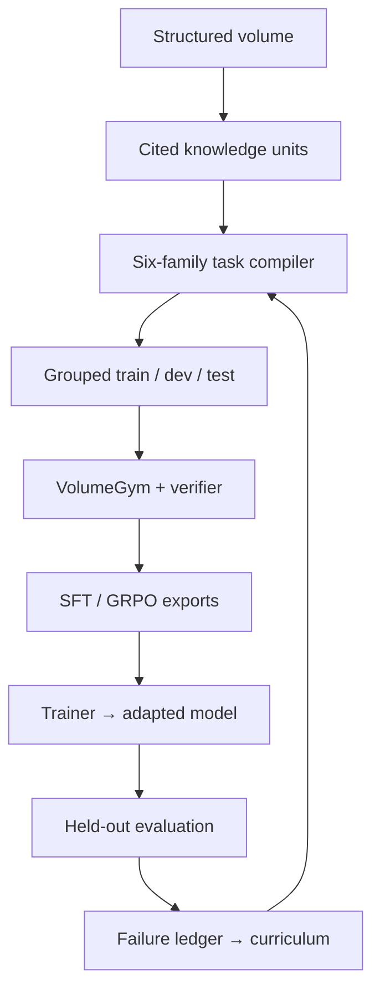

<div align="center">

# Volume2Gym

### Any single structured volume can become an RL gym that produces trainable models.

**Compile a book into grounded tasks, inspectable rewards, structural holdouts,
trainer-ready records, and a learning loop.**

[Generic compiler](#the-executable-core) ·
[Non-railroad quickstart](#quickstart-compile-a-fictional-volume) ·
[Railroad lineage](#the-entire-book-not-one-rule) ·
[Hugging Face dataset](https://huggingface.co/datasets/HarleyCooper/volume2gym-railroad-1959) ·
[Qwen3-4B LoRA](https://huggingface.co/HarleyCooper/Qwen3-4B-RailRoadEngineer1959)

`offline-first` · `provider-neutral` · `source-grounded` · `deterministic artifacts`

</div>

---

**Status — 18 July 2026:** executable v0.1 generic core, deterministic CLI,
offline test suite, trainer exports, symbolic reference evaluation, preserved
railroad lineage, and a rights-safe non-railroad proof volume. Reproducible
full-book neural training and model-level generalization remain open work.

> **A structured volume is a compressed environment.** Its sections name the
> world; its rules constrain action; its procedures encode order; its exceptions
> define edge cases; and its warnings describe failure. Volume2Gym makes that
> latent environment executable.

The project is not a question-answer generator wrapped in Gym vocabulary. It is
a compiler and artifact contract: every task retains its source units and
citations, every split holds out complete semantic groups, every deterministic
score has an inspectable component ledger, and every failure can become the
next curriculum request.

The gym is the training interface. A trainer consumes its tasks and rewards to
produce an adapted model. That boundary is deliberate: the same compiled volume
can drive SFT, GRPO-style optimization, another RL stack, or a transparent
symbolic reference policy without changing the source contract.

## From one volume to a learning loop



The current compiler creates one source-grounded task per knowledge unit for
each of these families:

| Task family | What it tests |
|---|---|
| `standard_operation` | Correct ordinary application |
| `edge_case` | Boundary conditions and missing facts |
| `conflict_resolution` | Compatible resolution of constraints |
| `exception_handling` | Exception triggers and normal-case boundaries |
| `violation_check` | Missing requirements, forbidden actions, and bad order |
| `adversarial_distractor` | Rejection of plausible but unsupported instructions |

## The executable core

This repository now contains a working, dependency-light Python package—not
only a project description.

| Layer | Current implementation |
|---|---|
| **Source contract** | Immutable Pydantic models for documents, spans, citations, knowledge units, tasks, answers, rewards, manifests, models, and learning cycles |
| **Extraction** | Strict provider-neutral span-to-unit bridge with caller-owned provenance, stable IDs, and explicit failures |
| **Compiler** | Provider-neutral, deterministic six-family compilation over arbitrary `KnowledgeUnit` records |
| **Holdouts** | Seeded grouping by rule family or connected knowledge-unit components; one group never crosses splits |
| **Artifacts** | Canonical JSON/JSONL, atomic writes, SHA-256 references, build manifests, validation, and inspection |
| **Gym** | Reproducible single-turn `reset`/`step` interface over compiled tasks |
| **Rewards** | Deterministic composite verifier with component evidence and an explicit safety hard gate |
| **Learning loop** | SFT and GRPO-style exports, symbolic reference trainer, evaluation records, failure clusters, and curriculum requests |
| **Adapters** | Optional PDF and provider interfaces, Hugging Face fixture import, and a recursive legacy railroad importer |

No API key, model download, railroad data, or network call is required to
compile, split, validate, inspect, or test the generic path.

## Quickstart: compile a fictional volume

[`examples/lantern_ledger/`](examples/lantern_ledger/) is an original fictional
tabletop protocol created for this repository. It contains no railroad content
and is licensed with the project. Its three canonical units prove the generic
path end to end.

```bash
git clone https://github.com/HarleyCoops/volume2gym.git
cd volume2gym
python -m pip install -e .

python -m volume2gym compile \
  --volume-id lantern-ledger-demo \
  --units examples/lantern_ledger/units.json \
  --output build/lantern-ledger \
  --seed 7

python -m volume2gym validate build/lantern-ledger
python -m volume2gym inspect-artifacts build/lantern-ledger

python -m volume2gym export build/lantern-ledger \
  --format sft \
  --split train \
  --output build/lantern-ledger/sft-train.jsonl

python -m volume2gym export build/lantern-ledger \
  --format grpo \
  --split train \
  --output build/lantern-ledger/grpo-train.jsonl

python -m volume2gym reference-eval build/lantern-ledger \
  --split test \
  --output build/lantern-ledger/reference-eval
```

The compile command currently returns:

```json
{
  "artifact_count": 5,
  "knowledge_unit_count": 3,
  "split_counts": {
    "dev": 6,
    "test": 6,
    "train": 6
  },
  "task_count": 18,
  "valid": true,
  "volume_id": "lantern-ledger-demo"
}
```

The output is a complete, hash-addressed build:

```text
build/lantern-ledger/
├── manifest.json
├── knowledge/
│   └── units.jsonl
├── tasks/
│   └── all.jsonl
├── splits/
│   ├── train.jsonl
│   ├── dev.jsonl
│   └── test.jsonl
├── sft-train.jsonl
├── grpo-train.jsonl
└── reference-eval/
    ├── responses.jsonl
    ├── reward_ledgers.jsonl
    └── evaluation.json
```

`export` writes trainer-ready records. `reference-eval` closes the local
artifact loop with the answer key itself and persists responses, component
ledgers, and a summary. It is explicitly **symbolic and non-neural**: it proves
that the contracts reconcile; it is not a trained-model result.

### Step the compiled gym

```python
from volume2gym.environment import VolumeGym
from volume2gym.exporters import reference_answer
from volume2gym.pipeline import load_build

build = load_build("build/lantern-ledger")
task = next(task for task in build.tasks if task.split.value == "train")

gym = VolumeGym([task])
observation, info = gym.reset(options={"task_id": task.task_id})
_, reward, terminated, truncated, step_info = gym.step(reference_answer(task))

print(reward, terminated, truncated)  # 1.0 True False
print(step_info["reward_ledger"]["components"])
```

`reference_answer` is the same inspectable symbolic contract reference used by
`reference-eval`, not a model. Feed the exported JSONL to a real trainer to
produce a neural artifact.

## The entire book, not one rule

The first implementation lineage targets the **entire 1959 Consolidated Code
of Operating Rules**. Rule 99 is not the project thesis, the book scope, or the
claimed unit of generalization.

The historical railroad pipeline notes report **536 extracted rules** and
**2,708 generated scenarios** across the volume. That implementation established
the direction—PDF to structured rules to tasks to environment to training—but
it was coupled to railroad prompts, duplicated its reward environment, and did
not publish the merged full-book corpus or a reproducible end-to-end neural run.
The original code is retained under [`legacy/railroad_1959/`](legacy/railroad_1959/)
for provenance; it is not the supported API.

### Why Rule 99 appears on Hugging Face

The [Rule 99 dataset](https://huggingface.co/datasets/HarleyCooper/volume2gym-railroad-1959)
is a deliberately small **contract fixture**: six training records and one
held-out record around one rule. It exercises the published schema, structured
answers, reward ledgers, evaluation record, failure cluster, and next-curriculum
shape.

That fixture is useful because it is small enough to audit. It is not evidence
that a neural model learned the entire book, transferred across rule families,
or generalized to another volume. The fixture's transparent symbolic adapter
is also not a neural checkpoint.

| Scope | Role | What is public now |
|---|---|---|
| **Volume2Gym** | General compiler and learning contract | Executable package, tests, CLI, non-railroad example, legacy adapter |
| **Railroad Engineer 1959** | First reported full-volume implementation lineage | Extraction/environment code and pipeline notes; merged reported corpus absent |
| **Rule 99 fixture** | One-rule regression and artifact-contract test | Six train rows, one held-out row, ledgers, curriculum artifacts, symbolic adapter |
| **Qwen3-4B railroad LoRA** | Neural artifact in the broader railroad lineage | Adapter weights and card; exact full training recipe is incomplete |

## One lineage, connected artifacts

| Artifact | Link | Evidence boundary |
|---|---|---|
| Volume2Gym source | [HarleyCoops/volume2gym](https://github.com/HarleyCoops/volume2gym) | Canonical generic implementation |
| Historical railroad source | [Qwen3-RailroadEngineer1959-RL](https://github.com/HarleyCoops/Qwen3-RailroadEngineer1959-RL/tree/main/RailroadEngineer1959) | Domain-specific predecessor |
| Full-pipeline implementation point | [`bf50635`](https://github.com/HarleyCoops/Qwen3-RailroadEngineer1959-RL/commit/bf50635729f6edaf8926f0c5c8d6037ce00f377c) | Historical source revision |
| Railroad pipeline notes | [PIPELINE_README.md](https://github.com/HarleyCoops/Qwen3-RailroadEngineer1959-RL/blob/main/RailroadEngineer1959/PIPELINE_README.md) | Reports 536 rules and 2,708 scenarios |
| Hosted railroad environment | [Prime Intellect](https://app.primeintellect.ai/dashboard/environments/harleycooper/railroad_1959) | Published legacy environment metadata |
| Neural railroad adapter | [Qwen3-4B LoRA](https://huggingface.co/HarleyCooper/Qwen3-4B-RailRoadEngineer1959) | Public weights/card; incomplete reproduction chain |
| One-rule dataset fixture | [volume2gym-railroad-1959](https://huggingface.co/datasets/HarleyCooper/volume2gym-railroad-1959) | Rule 99 contract fixture only |
| One-rule symbolic adapter | [volume2gym-railroad-1959-adapter](https://huggingface.co/HarleyCooper/volume2gym-railroad-1959-adapter) | Inspectable non-neural reference |
| Pinned local card/data snapshots | [`artifacts/huggingface/`](artifacts/huggingface/) | Small regression artifacts; large weights remain on HF |
| Coordinated Hub card sources | [`cards/huggingface/`](cards/huggingface/) | Reciprocal dataset/model-card copy with explicit scope boundaries |

There are no private repository links in the public project story.

## Evidence without theater

| Claim | Status |
|---|---|
| Arbitrary canonical units can compile through one generic contract | **Demonstrated locally** by the non-railroad example and offline tests |
| Each unit becomes six task families with source citations | **Implemented and inspectable** in `tasks/all.jsonl` |
| Semantic groups remain isolated across train/dev/test | **Implemented and validated** by the build validator |
| Builds are deterministic and tamper-evident | **Implemented** with canonical serialization, hashes, and manifests |
| The legacy importer handles the whole railroad rule list | **Implemented without a Rule 99 branch**; the full extracted corpus is not present here |
| The railroad pipeline produced 536 rules and 2,708 scenarios | **Reported upstream**, not independently reconstructable from the public merged data |
| The public Qwen3-4B LoRA came from this exact reproducible compiler build | **Not established** by a complete public corpus, split, launcher, seed, and run trace |
| Within-book and cross-book neural generalization | **Research targets**, not current results |

The current deterministic verifier is not the same reward implementation as the
legacy Prime environment. The legacy environment uses a Claude judge weighted
50% safety, 30% procedure, and 20% terminology. The new generic core uses an
offline component contract with an explicit safety gate. The Rule 99 fixture
contains another small deterministic ledger example. They are related stages in
the lineage, not one interchangeable training run.

## Repository map

```text
volume2gym/
├── src/volume2gym/
│   ├── models.py              # versioned source, task, reward, and cycle contracts
│   ├── compiler.py            # six-family provider-neutral compiler
│   ├── splitter.py            # deterministic structural holdouts
│   ├── pipeline.py            # compile, validate, inspect
│   ├── artifacts.py           # canonical serialization and hashes
│   ├── verifier.py            # deterministic reward ledger + safety gate
│   ├── environment.py         # single-turn VolumeGym
│   ├── exporters.py           # SFT and GRPO-style records
│   ├── trainers.py            # symbolic reference trainer
│   ├── failures.py            # failure clusters and next curriculum
│   ├── extraction.py          # strict source-span to cited-unit bridge
│   ├── providers.py           # optional structured-generation adapters
│   ├── sources.py             # source I/O and optional PDF rendering
│   ├── profiles/railroad.py   # recursive legacy railroad importer
│   └── integrations/          # external artifact adapters
├── examples/lantern_ledger/   # original, rights-safe non-railroad proof
├── legacy/railroad_1959/      # preserved predecessor; unsupported API
├── artifacts/huggingface/     # pinned small HF card/data snapshots
├── cards/huggingface/         # coordinated live Hub card sources
├── provenance/upstreams.json  # machine-readable source revisions and omissions
├── docs/migration.md          # legacy-to-generic responsibility map
└── tests/                     # offline contracts and integration tests
```

## Compile another volume

1. Segment the volume into `KnowledgeUnit` records.
2. Attach at least one `Citation` to every unit; preserve document, span, page,
   section, quote, and confidence when available.
3. Encode explicit conditions, required actions, forbidden actions, ordered
   procedure steps, exceptions, and terms instead of hiding them in prompts.
4. Run `python -m volume2gym compile --units ...` and inspect the manifest.
5. Choose `--group-by rule_family` for conceptual holdouts or
   `--group-by knowledge_unit` for connected source-unit holdouts.
6. Export trainer records, train outside the compiler, evaluate on held-out
   tasks, and convert component failures into the next curriculum.

Provider-backed extraction is optional and isolated behind
`StructuredKnowledgeExtractor` and structured generator interfaces. The
extractor accepts ordered source spans, rejects malformed or empty output, and
rebuilds every citation from caller-owned provenance. The durable boundary is
the canonical unit JSON—not a particular model vendor, prompt, trainer, or
hosting service.

## Development

```bash
python -m pip install -e '.[dev]'
pytest
ruff check .
```

The CI path is offline. Optional capabilities are installed independently:
`volume2gym[pdf]`, `volume2gym[anthropic]`, `volume2gym[gemini]`,
`volume2gym[gym]`, and `volume2gym[huggingface]`.

## Rights, provenance, and safety

The code in this repository is Apache-2.0. That code license does **not**
silently grant rights to a source book, scan, or derived full-text corpus. The
fictional Lantern & Ledger example is original to this repository. The 1959
railroad scan and full derived corpus are not copied into this repository;
their provenance and redistribution basis must be resolved before repackaging.
Pinned Hugging Face snapshots retain their upstream scope and metadata.

Volume2Gym preserves citations so rights and provenance can remain attached to
derived tasks. A real release should also record the source hash, compiler
version, prompt/provider configuration where used, seed, artifact hashes, and
the license or rights status of every input.

The railroad material is a research lineage, not current operating instruction,
a safety certification, or a substitute for qualified personnel and applicable
rules.

---

<div align="center">

### Volume → Gym → Model → Evaluation → Better Curriculum

Built by [Christian H. Cooper](https://github.com/HarleyCoops) ·
Models and datasets on [Hugging Face](https://huggingface.co/HarleyCooper)

</div>
